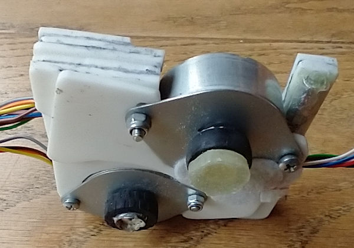
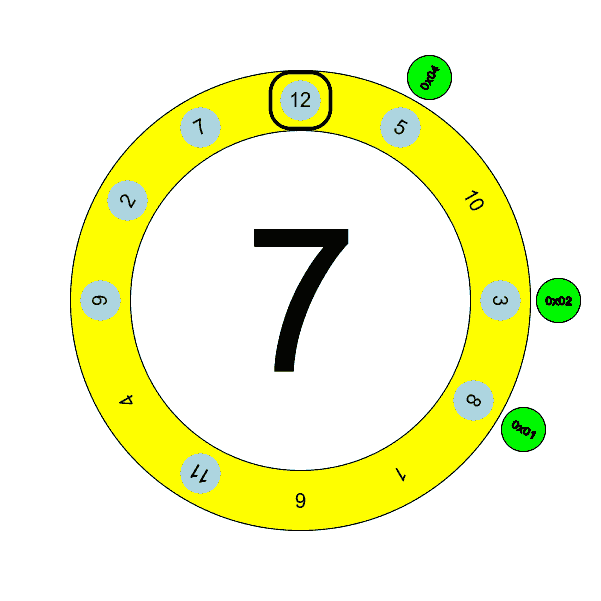

# Hourglass Clock
When browsing on hackaday, I saw a mesmerizing clock that flipped an hourglass every hour with rotating rings (https://hackaday.io/project/9663-hourglass-clock). A real piece of art with that 5:6 geared outer ring. I knew I wanted something like that too. So I set off to build this clock (although it uses two motors instead of that beautiful, clever geared ring):

[Click for timelapse video](doc/hourglassclock.mp4)

## Requirements ##
- It'll be in the living room so anyone must be able to tell the time
- It must make only little noise when operating
- It must run on (rechargable) batteries. No visible wires!
- It must run for at least 6 months before recharging is needed
- It must be completely autonomous (except for (dis)connecting the power supply for charging)
- It must definitely be amazing to look at

## Construction ##
The clock consists of two rotating rings on a frame of several layers of 18mm plywood. The frame and the rotating rings were created using a router, a battery drill and other hand tools. No CNC or 3D printed parts (well, I did buy the numbers on the outer ring in China and those are laser cut). Photos of constructing the clock can be found in the [git repository](doc/photos). The clock has 3 layers of plywood and a cover plate and as such has sufficient room to hide the batteries, the motors and all other electronic and mechanical parts.

The outer ring and the cover plate are made from the top plate of an Ikea SNUDDA lazy susan. I needed the bearings of the lazy susan for another project and that left me with a nicely finished pine wood disk of about 39 cm in diameter. The thickness of the disk is about 14 mm which provides just enough wiggle room for the rotating parts.

In the cover plate, there's an 1.54" e-ink display (HelTec) to show the minutes and some state (batteries, time sync, charging, wifi setup).

The rings were milled by drilling an 8mm hole in the center and putting a threaded rod through. Using a home made construction, the router bit can be locked to the correct radius. Then milling circles with increasing depth (about 4mm each iteration), the rings and the cresent shape between the two rings came out very nicely.

Milling the plywood resulted in a lots of soft fibers on the edges of the rings. Sanding did not really help as the fibers would just stick to the side. I gave up on trying to get rid of them. 

When all milling was done and the build neared completion, it was time to put on a nice clear topcoat. However, this resulted in a very rough finish because the fibers now became some kind of tough spikes along the edges of the clock. This time however, I could sand them of without problems because the fibers would not stick to the sides anymore. Sanding now left nice smooth edges and after two new layers of topcoat it looks very nice.
 
## Mechanics ##
The inner ring is standing on two pulleys and the stepper motor pushes on the top of the ring, forming a triangle. Unfortunately, the rings are not perfect circles and the wood also isn't perfectly flat so there needs to be some room for vertical and lateral motion in addition to the rotation. The stepper motors are mounted in a frame using a spring loaded mechanism. This mechanism allows for a couple of millimeters movement while keeping some pressure on the rings. The springs used here are salvaged from ball pens.

The outer ring has a flange, milled from 15mm MDF, attached to the back that sinks into the frame. The flange has a little ridge that locks behind the pulleys. The pulleys for the outer ring are place at about plus and minus 30 degrees from the top (vertical) and the flange just hanges on them. The top plate locks the outer ring in place but it's actually gravity that keeps everything in position. Just like the inner ring, the stepper motor pushes on top of the flange to make the outer ring turn and the spring loaded mechanism allows for a couple of millimeters of vertical movement while turning the ring.

## Motors ##
The clock uses two stepper motors that are mounted in such a way that they have a little vertical movement. This is necessary because the rings are not perfect circles. Because the pulleys are fixed to make sure everything stays in place, the motor construction must be able to compensate. The motor mount would be an ideal candidate for 3D printing but I do not have an 3D printer. Neither do I have experience in creating a 3D printable design nor with any of the design tools. It would probably take several iterations before I would have something usable so I decided not to try.

At first I tried to use a piece of MDF to create a frame for the motors but because of softness of the material and the space constraints, that failed. There just wasn't enough material left after milling. 

I do not have a 3D printer but I did have a sheet of 2.5mm acrylic so I embarked on the poor mans 3D modeling journey and using a jigsaw I cut out several layers acrylic and glued them together. 

Fortunately, this part is not visible from the outside so it doesn't need to look good. It just needs to be functional. Only the top and bottom plates need to be full plates. The layers in between are just filled with bits an pieces as spacers and glued together to make the frame ridgid.

The tension springs are inserted into little pieces of 6 mm aluminum pipe that are glued to the frame using epoxy glue. The rubber tyres on the stepper motors are actually LEGO tyres and are fit to the gears using a bit of ducttape and some epoxy glue to prevent the tyres from slipping off.

## Positioning ##
The inner ring contains the hourglass and rotates 180 degrees clockwise on the hour. The outer ring rotates 150 degrees counter clockwise on the hour. The position of the rings is determined by hall sensors detecting magnets. For the inner ring, there is one hall sensor and two magnets, each on opposite sides of the hourglass. This way triggering the hall sensor means the hourglass is in upright position. 

The outer ring has 3 hall sensors and 8 magnets strategically place along the outer ring to form a rotating code. As there are only three sensors and none of the sensors is triggered between the hour positions, there are only 7 valid combinations. This means not all of the hour positions have there own unique sensor value. However, normally the outer ring will turn 5 positions. While turning, it will pass several combinations and the rotating code has been designed in such a way that every two consecutive positions will uniquely determine the exact position of the outer ring. The animation below shows the rotating sensor values. Note that the animation shows the code as seen from the front of the clock. When mounting the magnets on the outer ring, you'll be looking at the back so the magnets are mirrored.

| hour | 12 | 5 | 10 | 3 | 8 | 1 | 6 | 11 | 4 | 9 | 2 | 7 | 12 | 5 | 10 | 3 |
| - | - | - | - | - | - | - | - | - | - | - | - | - | - | - | - | - |
| sensor | * | * |   | * | * |   |   | * |   | * | * | * | * | * |   | * |
| example |   |   |   |   |   |   |   |   |   |   | **@** | **^** |   | **^** | **^** |   |
|   |   |   |   |   |   |   |   |   |   |   |   | **0x04** | x | **0x02**  | 0x01 |   |
|   |   |   |   |   |   |   |   |   |   |   |   |   |   |    |   |   |

To determine the sensor value for a specific hour, take the four positions to the right and ignore the second one. The other three make up the sensor value. E.g. at 2 o'clock, take, 7, 12, 5 and 10. Ignore 12 and combine the other three. So 7 forms the most significant bit, 5 the middle bit and 10 the least significant bit. 7 and 5 have a magnet so that result in a sensor value of 6 (110 binary).

The rotating code has one more trick. The position for 1 o'clock and 2 o'clock do have unique values. This allows for better handling of daylight saving time changes. Because the clock knows and can verify its exact position when changing to and from dayligt savings time, it can skip turning the outer ring or reverse the direction because that requires less rotation.

## Electronics ##

The electronics of the clock are split into three parts. The control board with the main micro controller, a motor driver board for controlling the stepper motors and a battery control board for monitoring the batteries and for recharging.

### Control board ###

The control board is build around an ESP32. This is the perfect choice for this clock because it has lots of IO, it can synchronize the time using NTP and has a very low power deep sleep mode. 

The ESP32 module used here as no additional components like voltage regulators or an USB serial driver chip as those consume a lot of power. I added the RT9080 voltage regulator to reduce the voltage of the batteries to 3.3V. This voltage regulator has a very low quiescent current and a very low dropout voltage while still being able to provide 600mA. There's no USB to serial converter on board but that is easily connected using the connector on the left of the board that breaks out the required GPIO pins. The three jfets in the middle of the board are level shifters to make sure the ESP never sees over 3.3V on it's IO pins.

Almost all available IO pins are used to connect to the e-ink display, the hall sensors, the motor driver board and the battery control board, etc. so you can imagine that the bottom side of the control board is a big mess of wires. Of course I could have designed a nice PCB and have that made professionally but as this is a one off and I'm probably not going to make something like this again so it's not worth the time or money.

### Battery control ###

The battery control board is using an ATMega328P as brains. It is responsible for monitoring the battery voltages and the charger state and providing that information to the ESP.

The battery control board is in power down most of it's time. It only wakes up when the ESP requests the battery voltages and charger state (on the hour when it needs the rings to turn) or when the external PSU is connected to recharge the batteries. The ESP and the battery board communicate using SPI. The communication is only from the battery board to the ESP and the battery board is the master. Therefore, only the CS, SCK and MOSI pins are connected.

When the ESP is not requesting the battery voltages, the SCK and MOSI pins of the SPI are used to signal the charger state with a "static" two bit value. The Atmel is in power down but the IO lines are set to a state that indicates whether or not the batteries are being charged.

The power circuits have been designed to work with 3 or 5 batteries. One battery is used to power the control boards. The other batteries are used for powering the motors (as one or two sets of two batteries in series). The idea behind this is that the motors draw a lot of current and that a single set of batteries could be depleted in a couple of months. By adding the posibility to power each of the motors with its own set of batteries, the clock will run twice as long on a single charge.

However, the way it looks now, the battery powering the control board is drained faster than expected and the single set of batteries for the motors are depleted much slower than expected. So it seems the battery control board is overengineered.

Charging is handled by 3 TP4056 chips. These chips require the batteries to be connected to ground. As two  of the batteries (or two times two batteries) are connected in series, a set of relays is added to make sure the batteries can be properly connected to the TP4056. The relays also handle switching between charging the first or the second set of motor batteries. When the external PSU is not connected, all relays are deactivated as they receive their power from the PSU and the batteries are directly connected to the motor driver board and the ESP. At the same time, the TP4056s are completely disconnected to make sure they don't consume any power. Only when the PSU is connected, the relays are activated and the TP4056s are connected.

Charging is interrupted when the clock needs to turn the rings. When charging, the motor batteries are disconnected from the motor driver board, so to rotate the rings, this needs to be undone. On the hour, the ESP will signal the Atmel to interrupt charging, restore the battery circuit, measure the battery voltages and send voltage and charging state information to the ESP using SPI. When the clock has finished rotating the rings, the relays are activated again and charging continues as long as the external PSU is connected.

I swapped the current limiting resistors on the TP4056 boards to reduce the total charge current. These boards are normaly configured to a charge current of 1A so three of them would require 3A from the power supply. I reduced to load current on each of the boards to about 650mA so the total current required from the PSU stays below 2A. This way I can use a normal phone charger to recharge the batteries.

### Motor drivers ###

The motor control is handled by the TMC2209 drivers. The TMC2209 has silent step technology and that's no lie! The motors make only a soft humming noise when running and most of the noise the clock makes is because of the friction of the wooden rings. The drivers are highly configurable and give a great level of control. The ESP32 uses the UART interface of the TMC2209 to control the stepper motors. The driver board also has two mosfets to turn the power of the motor drivers on and off reducing power consumption of the motor batteries as much as possible.

## E-ink display ##

The HelTec 1.54" e-ink display is definitely the cheap version of the comparable Waveshare one. The reset line is not brought out to the connector and although the datasheet says it supports partial updates and the full update time is about 2 seconds, there's only one waveform on board and that's the full update one for low temperatures which takes over 4 seconds. There's no partial update waveform stored in the module itself so it has to be manually loaded. Heltec has a [git repository](https://github.com/HelTecAutomation/e-ink) with a partial update example. It works, but there is very little explanation and again the waveform used in the example takes a long time to complete the partial update.

All e-ink driver libraries I could find seem to be based on Arduino or derived from Arduino libraries. These seem to be made without much knowledge of the datasheet, include huge delays and none of them use any of the ESPs facilities like DMA transfers for SPI. I don't pretend to know better but as for this clock power consumption is an issue, I don't think it's wise to spend hundreds of milliseconds waiting for reset or between commands while the ESP is using lots of current and the display is doing absolutely nothing.

So, I wrote my own driver, using DMA based SPI at a much higher speed and reducing delays. I purposly did not use a full fledged graphics library although these will do a much better job in general. However, I only need very limited functionality. I could not find a font of the required size so I created a custom one. Because the ESP has more dan enough resources for a small display like this, I could just use a single memory buffer for the displays entire bitmap.

As I said, there's very little explanation on the partial update so I had to figure that out too. As far as I understand it now, the BW display supports partial updates by (ab)using the red ram buffer of the display. As result, I think BWR and BWY displays do not support partial updates.

To be able to do partial updates, you first need to fill both the BW ram buffer (cmd=0x24) and the red ram buffer (cmd=0x26) with the same image and do a full update of the display (cmd=0x22 and data=0xC7 followed by cmd=0x20). After that, you can load the partial update wave form (which has the pingpong bit set, no explanation found but it's mentioned somewhere in de datasheet). After loading the waveform, you can write the changes for your partial update to the BW ram buffer (cmd=0x24 only) and fire a partial update command (cmd=0x22 and data=0xCF followed by cmd=0x20). The display will now combine the contents of the red ram buffer with the partial changes in the BW buffer and use that to update the display. The display also makes sure the red ram buffer gets a new copy of the current state of the display. If you did not write your initial image to the red ram buffer, you get very strange results from partial updates so the first steps are crucial here.

To have better control over the display, I soldered an extra wire directly to the reset pin of the flexible connector. 

The IO pins of the display are 5V tolerant but the power line is not. HelTec has added a low drop voltage regulator to allow the display to be used direcly from an Arduino. This is quite nice. I'm using this display at 3.3V only, so I removed the voltage regulator from the display to save some more power. 

Finally, I modified the partial waveform from the HelTec example slightly to be about 3 times faster. I compared the results with the original waveform but I could not detect any differences in the amount of ghosting after partial updates. 

I would like to improve the waveforms some more, especially by getting the correct values for Vcomm. Unfortunately, I've not found any way to extract the embedded Vcomm values nor the waveforms from the display module. Normally, Vcomm is printed somewhere on the module but my module doesn't seem to have that.

## Firmware ##
The firmware for the clock is quite simple and mainly based on the deep sleep example in the esp-idf example directory. When the ESP boots up, it checks the RTC time and updates the e-ink display accordingly. When the minutes end with a zero, it does a full update, otherwise, it'll do a partial update of the display. On the full hour (minutes=0), the clock will start a task to rotate the rings. It'll read the battery voltages, enable the motor drivers, start the motors and while rotating try to find the correct position to stop.

When all these tasks are done, the ESP goes to deep sleep for the rest of the minute.

Once every day (and on cold boot), the clock will start the WIFI and synchronize the RTC using SNTP (also from the esp-idf example).

### ULP ###
To reduce the power consumption of the clock as much as possible (see below), the ULP of the ESP32 is used. The main program will send all commands and data to the e-ink display to do a full or partial update. However, it'll not wait for the update to complete but go to sleep immediately. At this stage the ULP takes over. It monitors the displays busy line and when it indicates the display is no longer busy, the ULP will bitbang the deep sleep command on the SPI interface to the display. After that, the ULP shuts down.

The documentation on the ULP is quite bad. The instruction set is described OK but documentation on how to configure GPIO pins is very bad. With trial and error I managed to get it working but I have no clue why I have to do some parts of the RTC GPIO configuration in the main program and other parts in the ULP code itself. Also I could not find any information on how to configure the pins. Some IO pins need to be configured in a different way than others and I could not find any logic to that.

### Reset loop prevention ###
The firmware has some additional checking on crashes. When the ESP32 wakes up, a restart reason is available. Normally, this will be "wake from deep sleep". However when the clock boots up after a brown out or a panic, the firmware keeps track of the number of consecutive crashes to prevent reset loops.

The idea behind this is that brown out resets will happen when the batteries are almost depleted and the WIFI is being activated for time synchronization. Switching on the radio requires a lot of current so the battery voltage will drop and a brownout may occur, reseting the ESP. Activating the WIFI immediately after a brown out reset seems to consume less power and often still succeeds.

When the ESP keeps reseting without completing one cycle (all the way to deep sleep), the firmware will not try to synchronize the time anymore and hopefully that stops brownouts from occuring letting the clock run for a while longer.

After an unexpected reset, the rings will not rotate, also to prevent strange behaviour when the batteries are almost depleted.

## Power consumption ##
The clock spends most of it's time in deep sleep and consumes about 85uA. This is of course higher then the 10uA from the datasheet, but the datasheet does not include the other electronic parts that make up the complete circuit. In all, that 85uA is not too bad.

In the first versions of the firmware, in active mode (i.e. ESP cores are running) the clock used about 45mA. The ULP was not used. This left the active run time to about 670msec when the minutes do not end in a zero and about 4.3 seconds when the minutes do end in a zero (i.e. 6 times per hour).

After a little over 2 months of operation, the battery powering the ESP was already much more drained than I expected. As there is not a lot I can do to lower the deep sleep power consumption, I needed to reduce the active power consumption as much as possible. 

The easiest step was to reduce the clock frequency of the ESP. It was on 160MHz and I lowered it to 80MHz. I'm now measuring about 38mA when active.

Of course that is not nearly enough so I decided to reduce the active time as much as possible. To do so, I decided not to wait for the e-ink display to be done updating but go to sleep as soon as possible. The e-ink display uses about 2mA when active so that sounds like a good deal. However, that means that it'll use 2mA all the time because it never goes to sleep. I decided to use the ULP to wait for the display to finish and have the ULP send the deep sleep command. This works perfectly and reduced the active time to about 300msec.

Finally I reduced the log levels in the bootloader and the application. This reduced the active time considerably. On a partial update, it's now active for about 175msec, on a full update for a little over 200msec and on the hour it is still about 4 seconds becuase that's the time needed to rotate the rings.

After 80 days of operation, these changes where added to the clock. It ran for another 60 days after that on the same battery charge. Because the average power consumption is now a lot better (50% or less), I expect the clock to run for about 8 or 9 months on a single charge.

## User manual ##
As this is a fully autonomous clock, there's not a lot the user can do. However there are two reed switches left and right of the "1" position ( 30 degrees). The left one makes the clock enter setup mode. The right one is connected to the reset pin of the ESP32. Also there's a barrel jack on the bottom to connect an external 5V (atleast 2A) power supply for charging.

### reset switch ###
The reset switch is located just right of the "1" position at the back of the clock, against the wall. Bringing a magnet close to that position will reset the clock.

### setup switch ###
Just left of the "1" position at the back of the clock you'll find the setup switch. Bringing a magnet close to that position will bring the clock in setup mode. In this mode, the clock can be updated with a new firmware (OTA). It also allows for configuring the WIFI connection. I've included [Tony Pottiers excellent wifi manager](https://github.com/tonyp7/esp32-wifi-manager) to allow easy WIFI configuration.

When entering setup mode, the display will show the firmware version, the access point name and the IP address assigned to the clock. When the clock is not connected to an access point, the wifi manager creates an access point for itself in the ESP32. The display will show the name of the access point, the IP address it selected for itself and the (generated) password to use for connecting.

Opening a browser and connecting to the IP address of the clock will open the webpages for the setup which display the firmware version, the battery voltages and the charger state and provide access to the WIFI manager and the firmware update (OTA).

### battery states ###
The clock is currently running in 3 battery mode. It shows two batteries on the display. The right symbol show the state of the battery used to power the ESP32. The left symbol show the state of the batteries used to power the motors. The following states can be displayed.

| battery  full | battery OK | battery low| battery empty | battery depleted |
| :-: | :-: | :-: | :-: | :-: |
||||||

To switch to 5 battery mode, except for adding two more batteries, two jumpers need to be changed on the battery control board. In 5 battery mode, the display will show 3 batteries on the display. The middle battery symbol is for the second set of motor batteries. 

### sync states ###
On the bottom right of the display, the state of time synchronization is shown. The symbols have been designed to become increasingly more notable when succesful synchronization is longer ago. The following symbols are displayed to indicate the state of the time synchronisation.

 last succesful time sync was less then 24 hours ago \
 last succesful time sync was between 24 and 48 hours ago \
 last succesful time sync was between 48 and 72 hours ago \
 last succesful time sync was over 72h ago \
 time sync crashed but last succesful time sync was less then 24 hours ago \
 time sync crashed but last succesful time sync was between 24 and 48 hours ago \
 time sync crashed but last succesful time sync was between 48 and 72 hours ago \
 time sync crashed and last succesful time sync was over 72h ago

### charger states ###
Between the battery state and time synchronization indicator, the charging indicator can be displayed. When there's no external power supply connected, the display does not show a charging indicator. When charging, one of the following symbols is displayed.
| 3 battery mode | 5 battery mode |
| -------------- | -------------- |
| charging batteries | charging set 1 batteries |
| | charging set 2 batteries |
| batteries fully charged | batteries fully charged |

